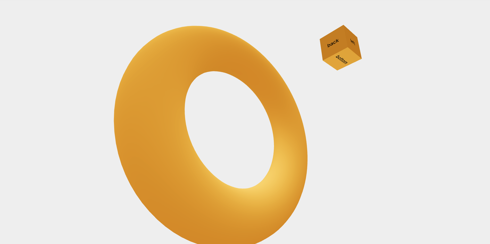

## Using React + TypeScript + R3F



This project is built using React and TypeScript, combined with R3F (React Three Fiber) to create interactive 3D applications.

## Installation and Running

To get started, make sure you have Node.js version 20.x installed. Then, run the following commands to install and start the development server:

```bash
npm install
npm run dev
```
